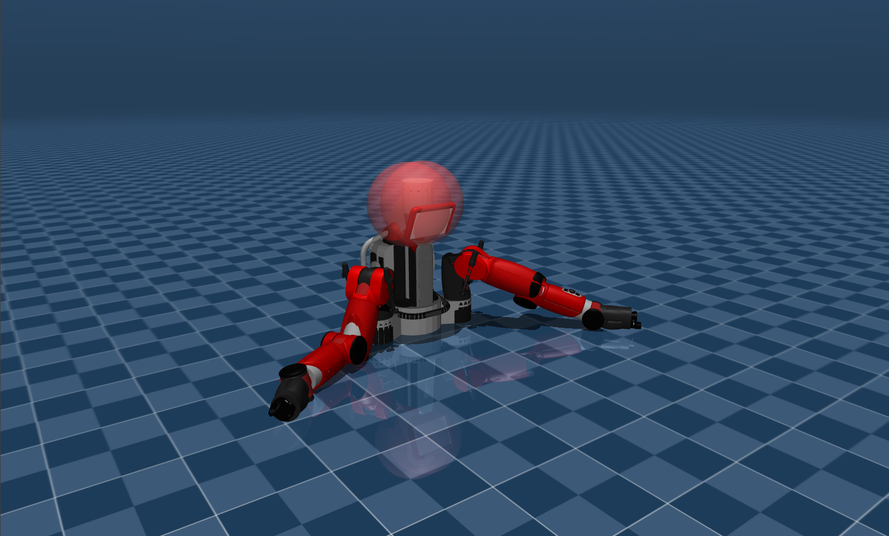

# Rethink Robotics Baxter Description (MJCF)

Requires MuJoCo 2.3.3 or later.

## Overview

This package contains a simplified robot description (MJCF) of the
[Baxter](https://en.wikipedia.org/wiki/Baxter_%28robot%29) developed by [Rethink
Robotics](https://www.rethinkrobotics.com).

  

The MJCF description was taken from [Robosuite](https://github.com/ARISE-Initiative/robosuite).

## License

This model is released under an [Apache-2.0 License](LICENSE).
