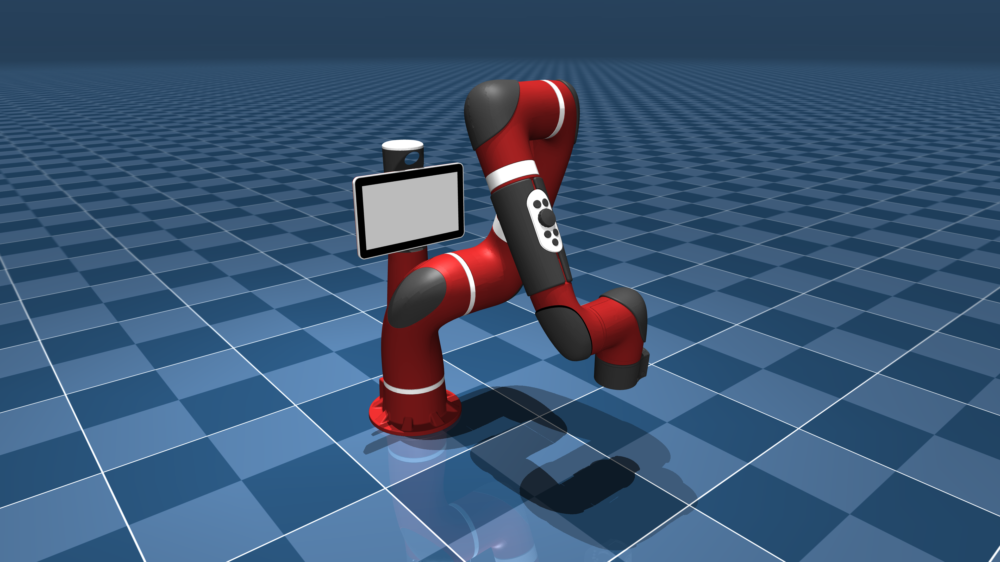

# Rethink Robotics Sawyer Description (MJCF)

> [!IMPORTANT]
> Requires MuJoCo 2.3.3 or later.

## Changelog

See [CHANGELOG.md](./CHANGELOG.md) for a full history of changes.

## Overview

This package contains a simplified robot description (MJCF) of the
[Sawyer](https://www.rethinkrobotics.com/sawyer) developed by [Rethink
Robotics](https://www.rethinkrobotics.com). It is derived from the [publicly
available URDF
description](https://github.com/RethinkRobotics/sawyer_robot/tree/master/sawyer_description).

  

## URDF → MJCF derivation steps

1. Converted the DAE [mesh
   files](https://github.com/RethinkRobotics/sawyer_robot/tree/master/sawyer_description/meshes)
   to OBJ format using [Blender](https://www.blender.org/).
2. Processed `.obj` files with [`obj2mjcf`](https://github.com/kevinzakka/obj2mjcf).
3. Eliminated faulty head submeshes.
4. Added `<mujoco> <compiler discardvisual="false"/> </mujoco>` to the
   [URDF](https://github.com/RethinkRobotics/sawyer_robot/blob/master/sawyer_description/urdf/)'s
   `<robot>` clause in order to preserve visual geometries.
5. Loaded the URDF into MuJoCo and saved a corresponding MJCF.
6. Added a tracking light to the base.
7. Manually edited the MJCF to extract common properties into the `<default>` section.
8. Added `<exclude>` clauses to prevent collisions between `base` and `right_l0`.
9. Manually designed collision geometries.
10. Added position-controlled actuators for the arm.
11. Darkened the red color to more closely match the hardware.
12. Added home joint configuration as a `keyframe`.
13. Added `scene.xml` which includes the robot, with a textured groundplane, skybox, and haze.

## License

This model is released under an [Apache-2.0 License](LICENSE).
