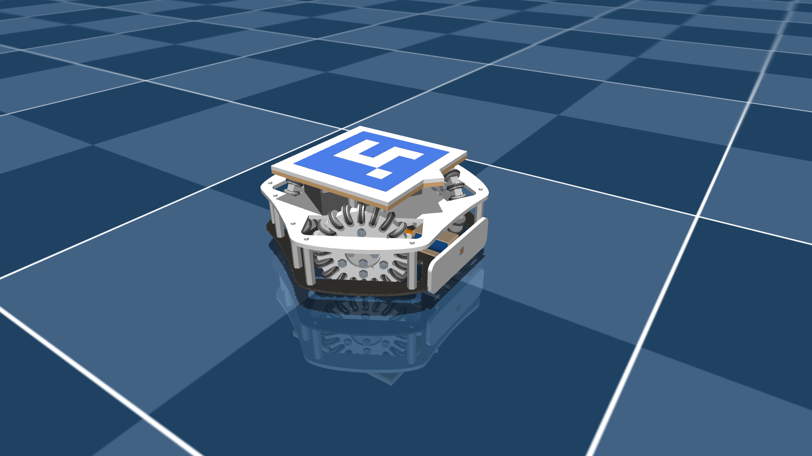

# Robot soccer kit omnidirectional

## Overview

This package contains a robot description (MJCF) of a [Robot Soccer Kit omnidirectional robot](https://robot-soccer-kit.github.io/). All passive wheels (20 per wheel) are simulated as passive joints.

No accurate system identification was performed, so the model is not expected to be highly accurate for control purposes.

  

## CAD → MJCF conversion

The model was converted using [onshape-to-robot](https://onshape-to-robot.readthedocs.io/) from the [Onshape CAD assembly](https://cad.onshape.com/documents/81e7adfaf4d8d74f2936fbd5/w/97141f458dee8c3b80cbf3d2/e/5e1ff591ff562de3da8ed2af).

The conversion configuration ([config.json](config.json)) was kept in the package for reference. Only passive wheels were kept for collision, using pure cylinders.

## License

This model is released under an [MIT License](LICENSE).
