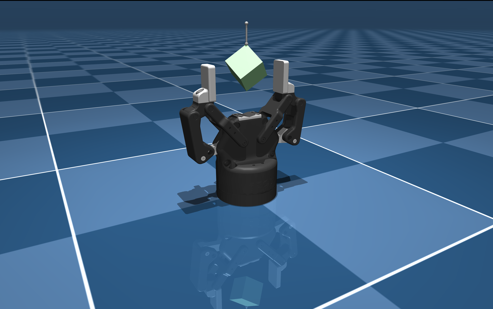

# Robotiq 2F-85 Description (MJCF)

> [!IMPORTANT]
> Requires MuJoCo 2.2.2 or later.

## Changelog

See [CHANGELOG.md](./CHANGELOG.md) for a full history of changes.

## Overview

This package contains a simplified robot description (MJCF) of the [Robotiq 85mm
2-Finger Adaptive
Gripper](https://robotiq.com/products/2f85-140-adaptive-robot-gripper) developed
by [Robotiq](https://robotiq.com/). It is derived from the [publicly available
URDF
description](https://github.com/ros-industrial/robotiq/tree/kinetic-devel/robotiq_2f_85_gripper_visualization).

  

## URDF → MJCF derivation steps

1. Downloaded gripper step file containing CAD information: https://blog.robotiq.com/hubfs/support-files/2F85_Opened_20190924-Sep-06-2024-02-25-46-4707-PM.step
2. Downloaded fingertips step file: https://blog.robotiq.com/hubfs/support-files/C-083-PAD_SURMOULE_85_defeature_20191025-Sep-06-2024-02-26-08-4297-PM.step
3. Created assembly file using onshape and joint limits from robotiq_2f85 XML model.
4. Used onshape-to-robot to export assembly file to URDF : https://github.com/Rhoban/onshape-to-robot
5. Converted URDF to MJCF by loading the model in simulate and saved the XML.
7. Used robotiq_2f85 XML as inspiration. Kept new XML very similar to the robotiq_2f85.
8. Changed value of tendon coef from 0.5 to 0.485 to make sure that fingertips touch.
7. Used inertia and mass from robotiq_2f85 model.
9. Added `scene.xml` which includes the robot, with a textured groundplane, skybox, and haze.
10. Added hanging box to `scene.xml`.

## License
This model is released under a [BSD-2-Clause License](LICENSE).
