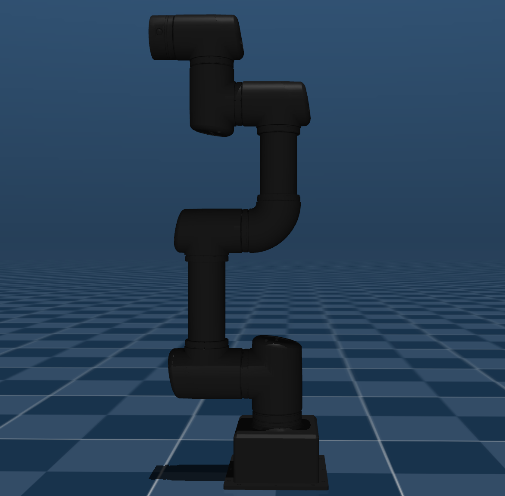

# ROBOTIS OMY 3M Description (MJCF)

> [!IMPORTANT]
> Requires MuJoCo 2.3.3 or later.

## Changelog

See [CHANGELOG.md](./CHANGELOG.md) for a full history of changes.

## Overview

This package contains a simplified robot description (MJCF) of the [ROBOTIS OMY](https://ai.robotis.com/omy/introduction_omy.html) developed by [ROBOTIS](https://robotis.com/). It is derived from the [publicly available](https://github.com/ROBOTIS-GIT/open_manipulator/tree/main/open_manipulator_description/urdf/omy_3m) URDF description.

The OMY 3M is a 6-DOF fixed-base robotic manipulator designed for research and industrial manipulation tasks.

  

## URDF → MJCF derivation steps

1. Converted the STL mesh files from the [ROBOTIS open_manipulator repository](https://github.com/ROBOTIS-GIT/open_manipulator/tree/main/open_manipulator_description/meshes/omy).
2. Added `<mujoco> <compiler discardvisual="false"/> </mujoco>` to the URDF's `<robot>` clause in order to preserve visual geometries.
3. Loaded the URDF into MuJoCo and saved a corresponding MJCF.
4. Manually edited the MJCF to extract common properties into the `<default>` section.
5. Added position-controlled actuators with carefully tuned PD gains.
6. Added `fullinertia` values directly from the URDF for accurate dynamics simulation.
7. Added home joint configuration as a `keyframe`.
8. Added `scene.xml` which includes the robot, with a textured ground plane, skybox and haze.

## Actuator specifications

The OMY 3M uses DYNAMIXEL motors with the following specifications:

| Joint | Motor | Max Torque (Nm) |
|-------|-------|-----------------|
| Joint 1, 2 | DY-80 | 61.4 |
| Joint 3, 4, 5, 6 | DY-70 | 31.7 |

## License

This model is released under an [Apache-2.0 License](LICENSE).
