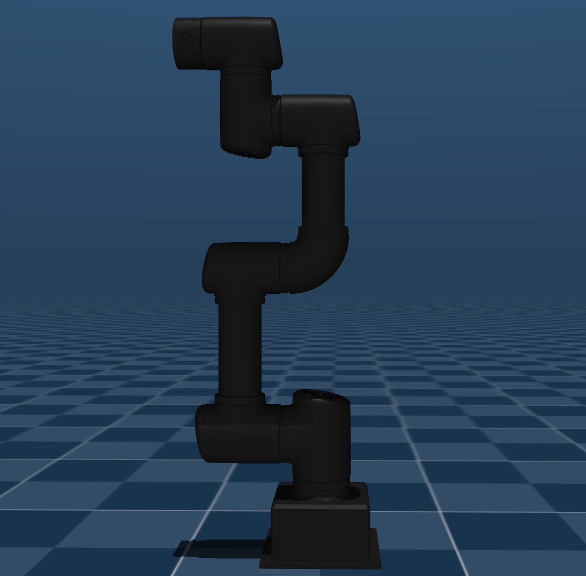

# ROBOTIS OMY-3M Description (MJCF)

> [!IMPORTANT]
> Requires MuJoCo 2.3.3 or later.

## Changelog

See [CHANGELOG.md](./CHANGELOG.md) for a full history of changes.

## Overview

This package contains a simplified robot description (MJCF) of the [ROBOTIS OMY](https://ai.robotis.com/omy/introduction_omy.html) developed by [ROBOTIS](https://robotis.com/). It is derived from the [publicly available](https://github.com/ROBOTIS-GIT/open_manipulator/tree/main/open_manipulator_description/urdf/omy_3m) URDF description.

The OMY-3M is a 6-DOF fixed-base robotic manipulator designed for research and industrial manipulation tasks.

  

## URDF → MJCF derivation steps

1. Reused the STL visual meshes from the [ROBOTIS open_manipulator repository](https://github.com/ROBOTIS-GIT/open_manipulator/tree/main/open_manipulator_description/meshes/omy_3m).
2. Added `<mujoco> <compiler discardvisual="false"/> </mujoco>` to the URDF's `<robot>` clause in order to preserve visual geometries.
3. Loaded the URDF into MuJoCo and saved a corresponding MJCF.
4. Manually edited the MJCF to extract common properties into the `<default>` section.
5. Added position-controlled actuators with a unit damping ratio and the documented maximum motor torques as force
   limits.
6. Added `fullinertia` values directly from the URDF for accurate dynamics simulation.
7. Preserved the cylinder collision primitives from the URDF and the disabled collision pairs from the MoveIt SRDF.
8. Added an `attachment_site` at the URDF end-effector frame and the ROBOTIS initial configuration as the `home` keyframe.
9. Added `scene.xml` which includes the robot, with a textured ground plane, skybox and haze.

## Validation

- The compiled mass, center of mass, principal inertia and inertial orientation of all six moving links match the
  source URDF exactly.
- Forward kinematics match the source URDF exactly over 1,000 seeded random configurations, and the maximum
  absolute gravity-bias difference is `1.1e-14` N m.
- The collision primitive poses and dimensions match the source URDF, and the `home` keyframe is contact-free.

## Actuator specifications

The OMY-3M uses DYNAMIXEL motors with the following specifications:

| Joint | Motor | Continuous torque (N m) | Maximum torque (N m) |
|-------|-------|-------------------------|----------------------|
| Joint 1, 2 | YM080-230-A099-RH | 26.0 | 61.4 |
| Joint 3, 4, 5, 6 | YM070-210-A099-RH | 14.6 | 31.7 |

The position actuators use the documented maximum torque as their force limit. See the
[OMY hardware specifications](https://ai.robotis.com/omy/hardware_omy.html) and the
[DYNAMIXEL-Y specifications](https://emanual.robotis.com/docs/en/dxl/y/) for the source values.

## License

This model is released under an [Apache-2.0 License](LICENSE).
