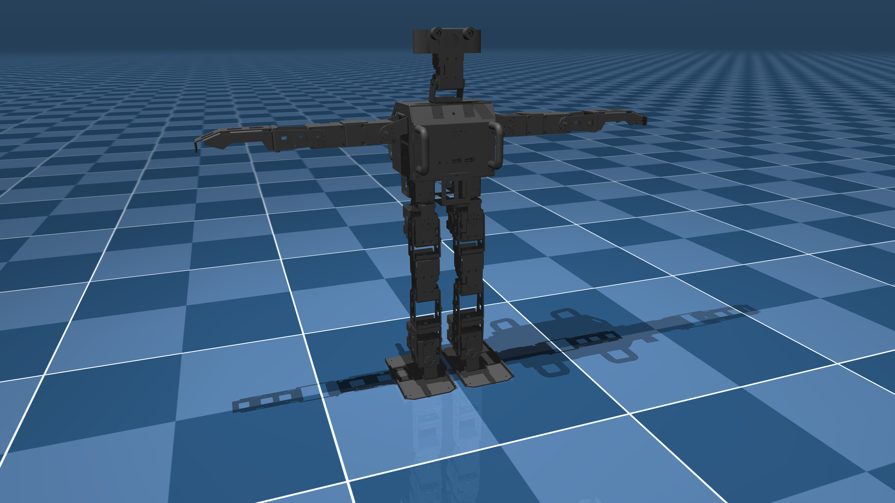

# Robotis OP3 Description (MJCF)

> [!IMPORTANT]
> Requires MuJoCo 2.2.2 or later.

## Changelog

See [CHANGELOG.md](./CHANGELOG.md) for a full history of changes.

## Overview

This package contains a simplified robot description (MJCF) of the [Robotis
OP3](https://emanual.robotis.com/docs/en/platform/op3/introduction/) developed
by [Robotis](https://robotis.com/). It is derived from the [publicly
available](https://github.com/ROBOTIS-GIT/ROBOTIS-OP3-Common/tree/master/op3_description/urdf)
URDF description.

  

## URDF → MJCF derivation steps

The meshes in `assets/simplified_convex` are simplified convex hulls of the
original STL meshes from Robotis. Filenames with suffix `_subN` (where `N` is a
number) represent meshes that have been decomposed into multiple parts before
convexification.

1. Load original STL files into [MeshLab](https://meshlab.net/).
2. If the mesh has protruding parts that are not well-captured by single
    convex hull, right-click on the loaded mesh layer and select
    **Split in Connected Components**, then flatten things back into component
    groupings as appropriate. (Note that the split will only work if the
    original STL contains disconnected components, rather than a single
    joined-up one.)
3. Filters -> Remeshing, Simplification and Reconstruction -> **Convex Hull**
4. Filters -> Remeshing, Simplification and Reconstruction -> **Simplification:
   Quadric Edge Collapse Decimation**
5. Adjust the target number of faces. For the OP3, around 300 faces seem to
   capture things fairly well.
6. The options **Preserve Boundary of the Mesh**, **Preserve Normal**,
   **Preserve Topology**, and **Planar Simplification** were enabled. These may
   or may not be necessary.

## License

This model is released under an [Apache-2.0 License](LICENSE).

