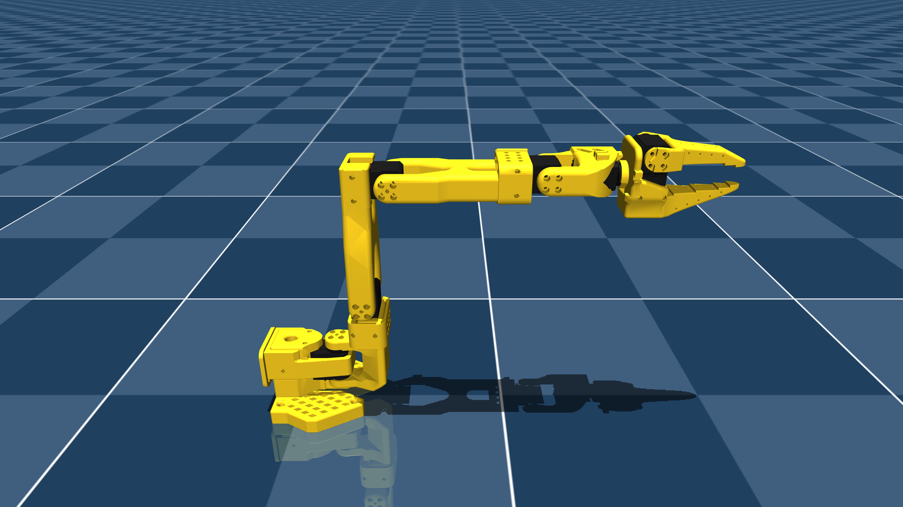

# The Robot Studio SO101 Description (MJCF)

> [!IMPORTANT]
> Requires MuJoCo 3.1.3 or later.

## Changelog

See [CHANGELOG.md](./CHANGELOG.md) for a full history of changes.

## Overview

This package contains a robot description (MJCF) of the [The Robot Studio SO101 robot](https://github.com/TheRobotStudio/SO-ARM100/tree/main/Simulation/SO101) developed by [I2
RT Robotics]. It is derived from the [publicly available
MJCF](https://github.com/TheRobotStudio/SO-ARM100/blob/608122e9ac330a753735f2e18aee73338e9ac407/Simulation/SO101/so101_new_calib.xml#L1).

  

## MJCF derivation steps

1. Copied `so101_new_calib.xml` (commit SHA aec17bbc256d1a7342d53aaa4950595d4c30b40d).
2. Rounded floats and reformatted the XML for readability.
3. Switched to implicitfast.
4. Use default `forcerange` for actuators rather than 3.35 N/m.
5. Added primitive collision geometries for the gripper and arm.
6. Add default collision solver parameters for the gripper that work well for manipulation.
7. Add a camera mount.

## License

This model is released under the [Apache License 2.0](LICENSE).
