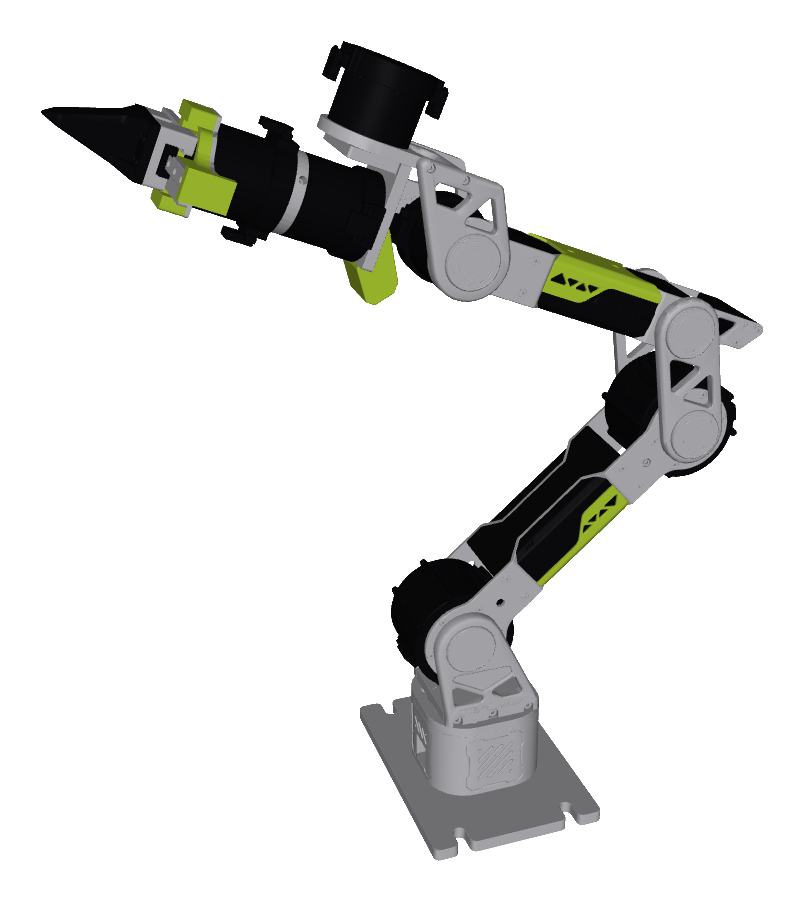

# Seeed Studio reBot DevArm Description (MJCF)

> [!IMPORTANT]
> Requires MuJoCo 3.2.0 or later.

## Changelog

See [CHANGELOG.md](./CHANGELOG.md) for a full history of changes.

## Overview

This package contains a robot description (MJCF) of the **reBot DevArm**, a
6-DOF manipulator with a 2-finger parallel gripper built by
[Seeed Studio](https://www.seeedstudio.com/) around
[RobStride](https://robstride.com/) quasi-direct-drive actuators (RS-06 for the
shoulder/elbow, RS-00 for the wrist and gripper). It is derived from the
publicly available URDF in the
[Seeed-Projects/reBot-Isaacsim](https://github.com/Seeed-Projects/reBot-Isaacsim)
repository.

  

### URDF → MJCF derivation steps

1. Converted the URDF body tree with [`urdf-to-mjcf`](https://github.com/discoverse-dev/urdf-to-mjcf).
2. Kept `gripper_end` as a separate body rather than merging it into `link6`
   across the fixed joint, and preserved all six components of every URDF
   inertia tensor, including the products of inertia. This keeps the MJCF
   bodies in one-to-one correspondence with the URDF links, so the two can be
   diffed link by link.
3. Fixed the base to the world and added the base link inertial.
4. Extracted joint and actuator properties into `<default>` classes.
5. Added position-controlled actuators with `ctrlrange` equal to the joint
   limits. Joint torque limits come from the actuator ratings (RS-06: 36 N·m,
   RS-00: 14 N·m), each read from the motor firmware over CAN on a physical arm.
6. Added `home` and `raised` keyframes.
7. Recovered the per-part colours (lime accent covers, black motors and
   gripper, aluminium brackets) from the mesh filenames — the source URDF
   stores every visual as flat grey.
8. Generated the collision geometry as a convex decomposition per link with
   [VisACD](https://github.com/3dlg-hcvc/visacd) (8–12 parts per link), and
   capped hull complexity with `<mesh maxhullvert="64"/>`.
9. Added `scene.xml` which includes the robot, a textured ground plane, skybox
   and haze.

### Gripper

The two fingers are driven by a single 1:1 rack and pinion, so they are coupled
through an `<equality joint>` rather than modelled as independent DOFs, and the
finger gains are derived from that transmission.

### Self-collision

Self-collision is enabled. The collision geometry is a convex decomposition
rather than one hull per link, which brings the collision volume down from
3.24× the true link volume to 1.89× and makes robot–robot contacts usable.

Eleven body pairs are excluded in `<contact>`. Nine are adjacent links that
share a motor housing and genuinely interpenetrate in the source meshes. The
other two — `gripper_left`/`gripper_right` and `link2`/`link5` — clear each
other by only 0.15 mm and 0.77 mm at the `home` keyframe, measured with exact
mesh-mesh queries on the source STLs. For the fingers that near-contact is at
the interleaved slider rail at the base, not at the jaws, which cross
scissor-fashion and never meet. Gaps that small are below what a convex
decomposition can represent, since its parts necessarily bulge ~1–2 mm past the
original concave surface. Both keyframes are contact-free.

### Validation

Mass, center of mass, and the full compiled inertia tensor were verified against
the source URDF for all 10 bodies. The generalized gravity torque g(q) was also
verified against Pinocchio (built from the same URDF) across several poses; the
two agree to under 1e-5 N·m. Pinocchio in turn matches the NVIDIA Isaac Sim
(PhysX and Newton) drive droop and the on-hardware measurements, so the model is
dynamically consistent with the URDF, the vendor's Isaac Sim asset, and the
physical arm.

Self-collision detection was checked against the source geometry: across
sampled poses, every body pair that actually interpenetrates in the source
meshes and is not deliberately excluded is reported as a contact by MuJoCo.

## License

This model is released under an [MIT License](LICENSE). The meshes and physical
parameters are derived from the
[Seeed-Projects/reBot-Isaacsim](https://github.com/Seeed-Projects/reBot-Isaacsim)
repository, which Seeed Studio publishes under the same MIT License; this
directory carries that license verbatim.
