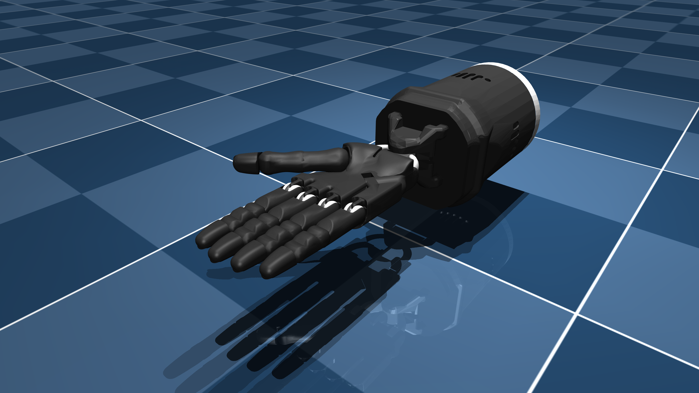

# Shadow Hand E3M5 Description (MJCF)

## Overview

This package contains assets of the "E3M5" version of the Shadow Hand robot,
including both right-handed and left-handed versions.
The original URDF and assets were provided directly by
[Shadow Robot Company](https://www.shadowrobot.com/) under the
[Apache 2.0 License](LICENSE).

  

## URDF → MJCF derivation steps

1. Converted the DAE [mesh
   files](https://github.com/shadow-robot/sr_common/tree/noetic-devel/sr_description/meshes/)
   to OBJ format using [Blender](https://www.blender.org/).
2. Processed `.obj` files with [`obj2mjcf`](https://github.com/kevinzakka/obj2mjcf).
3. Added `<mujoco> <compiler discardvisual="false"/> </mujoco>` to the
   [URDF](https://github.com/shadow-robot/sr_common/blob/noetic-devel/sr_description/hand/xacro/forearm/forearm_e.urdf.xacro)'s
   `<robot>` clause in order to preserve visual geometries.
4. Loaded the URDF into MuJoCo and saved a corresponding MJCF.
5. Removed `_E3M5` suffix from mesh names.
6. Added forearm body and its corresponding inertial specs.
7. Removed 2 artifact boxes left from the URDF conversion.
8. Manually edited the MJCF to extract common properties into the `<default>` section.
9. Added `<exclude>` clauses to prevent collisions between the forearm and the
    wrist and thumb bodies.
10. Added position-controlled actuators.
11. Added `impratio=10` for better noslip.
12. Hardened the contacts on the hand geoms.
13. Added `scene_left.xml` and `scene_right.xml` which include the robot, with
    an object, textured groundplane, skybox, and haze.

## License

These models are released under an [Apache-2.0 License](LICENSE).
