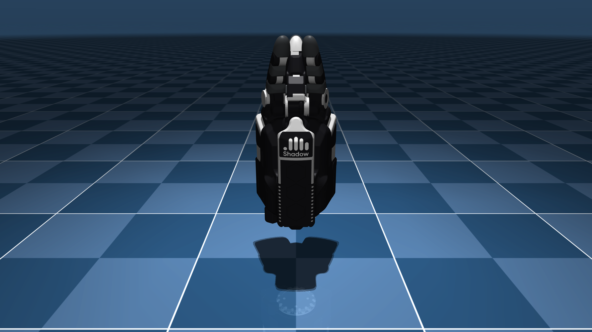

# New Shadow Hand Description (MJCF)

Requires MuJoCo 3.1.0 or later.

## Overview

This package contains a simplified robot description (MJCF) of the
[NEW-SHADOW-HAND](https://www.shadowrobot.com/new-shadow-hand/) developed by the
[Shadow Robot Company](https://www.shadowrobot.com/). The original assets were
provided directly by [Shadow Robot Company](https://www.shadowrobot.com/) under
the [Apache 2.0 License](LICENSE).

  

## MJCF

The source of truth for the New Shadow Hand in MuJoCo can be found in `new_shadow_hand.xml`.

This model was evolved alongside hardware development. The initial release
matches the hardware version at release (without tactile sensors).

Currently only joint position actuators are available. Other actuation modes to
follow.

## License

This model is released under an [Apache-2.0 License](LICENSE).
