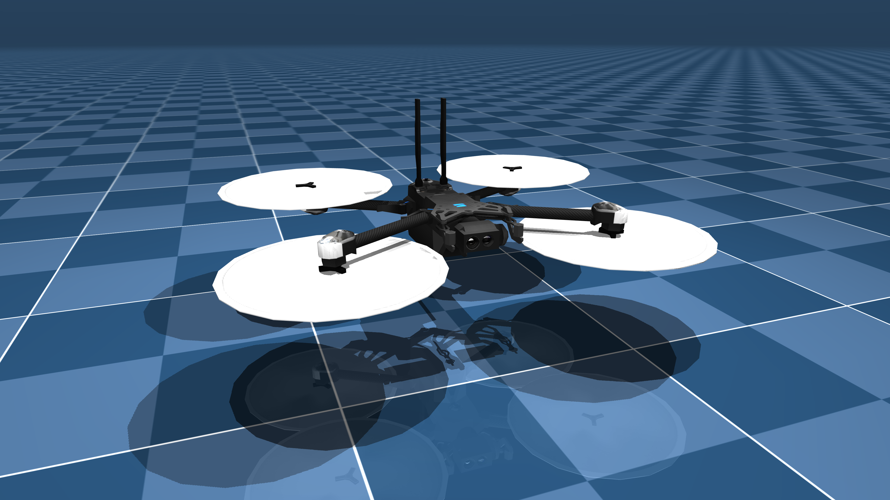

# Skydio X2 Description (MJCF)

> [!IMPORTANT]
> Requires MuJoCo 2.2.2 or later.

## Changelog

See [CHANGELOG.md](./CHANGELOG.md) for a full history of changes.

## Overview

This package contains a simplified robot description (MJCF) of the [Skydio X2](https://www.skydio.com/skydio-x2) drone developed by [Skydio](https://www.skydio.com/). The assets were provided directly by Skydio under the [Apache 2.0 License](LICENSE).

  

## License

This model is released under an [Apache-2.0 License](LICENSE).
