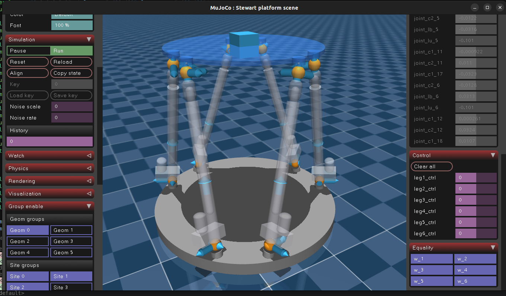

# Stewart Platform Description (MJCF)

> [!IMPORTANT]
> Requires MuJoCo 2.2.2 or later.

  

## Overview

This package provides a model of a Stewart platform (parallel robot) with the parameters listed below.

This Stewart platform is developed by [Duc Cuong Vu](https://github.com/duccuongvu) and [Viet Khanh Nguyen](https://github.com/vietkhanh-nguyen).

## Geometry
### Base anchor points `B` (fixed frame)

| Leg | x       | y       | z      |
| --- | ------- | ------- | ------ |
| 1   |  0.4830 |  0.1294 |  0.067 |
| 2   | -0.1294 |  0.4830 |  0.067 |
| 3   | -0.3536 |  0.3536 |  0.067 |
| 4   | -0.3536 | -0.3536 |  0.067 |
| 5   | -0.1294 | -0.4830 |  0.067 |
| 6   |  0.4830 | -0.1294 |  0.067 |

### Top anchor points `T` (platform frame)

| Leg | x       | y       | z      |
| --- | ------- | ------- | ------ |
| 1   |  0.2475 |  0.2475 | -0.067 |
| 2   |  0.0906 |  0.3381 | -0.067 |
| 3   | -0.3381 |  0.0906 | -0.067 |
| 4   | -0.3381 | -0.0906 | -0.067 |
| 5   |  0.0906 | -0.3381 | -0.067 |
| 6   |  0.2475 | -0.2475 | -0.067 |

## License

This model is released under an [MIT License](LICENSE).

## Changelog

See [CHANGELOG.md](./CHANGELOG.md) for a full history of changes.
