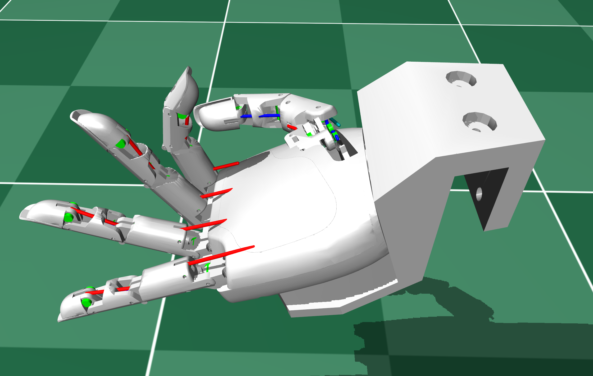

# Tetheria Aero Hand Open (MJCF)

## Changelog

See [CHANGELOG.md](./CHANGELOG.md) for a full history of changes.

## Overview

This package contains a **tendon-driven** robotic hand model for MuJoCo manipulation tasks. The Tetheria Hand features accurate cable-driven actuation with spatial tendons, springs, and pulleys that match the real hand's mechanical design.

  

## URDF → MJCF derivation steps
- Use `mjcf.from_path` to load the URDF file, and export the initial MJCF model with `mjcf.export_with_assets`.  
- Manually define simplified collision geometries.  
- Exclude unwanted collisions between specific geometries.  
- Design pulley elements to represent the cable routing in the hand.  
- Define tendons that follow the cable paths and wrap around the pulleys.  
- Add springs with the same specifications as those used in the *Aero Hand Open*.  
- Implement position actuators for the tendons and the hand’s abduction joint, setting parameters (e.g., armature) to match the motors from the *Aero Hand Open*.  
- Adjust stiffness, damping, and actuator gains to reproduce dynamics similar to the *Aero Hand Open*.  

## License

These models are released under an [Apache-2.0 License](LICENSE).