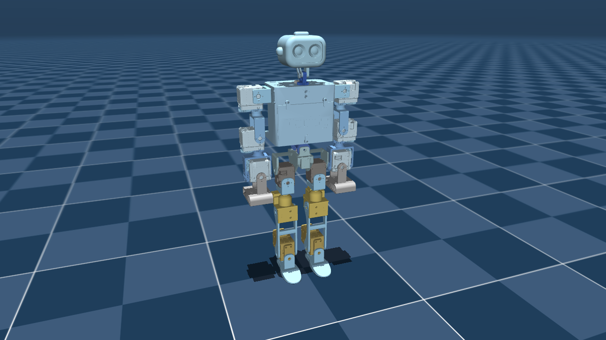

# ToddlerBot 2XC description (MJCF)

> [!IMPORTANT]
> Requires MuJoCo 2.3.3 or later.

## Changelog

See [CHANGELOG.md](./CHANGELOG.md) for a full history of changes.

## Overview

This package contains the MJCF of Stanford ToddlerBot (the 2XC variant). 

  

## OnShape → MJCF derivation steps

1. Access the open-source OnShape CAD designs [here](https://github.com/hshi74/toddlerbot).
2. Follow the instructions [here](https://hshi74.github.io/toddlerbot/tools/04_onshape_to_robot.html) to export the OnShape CAD designs to MJCF files.

## License

This model is released under a [MIT LICENSE](LICENSE).
