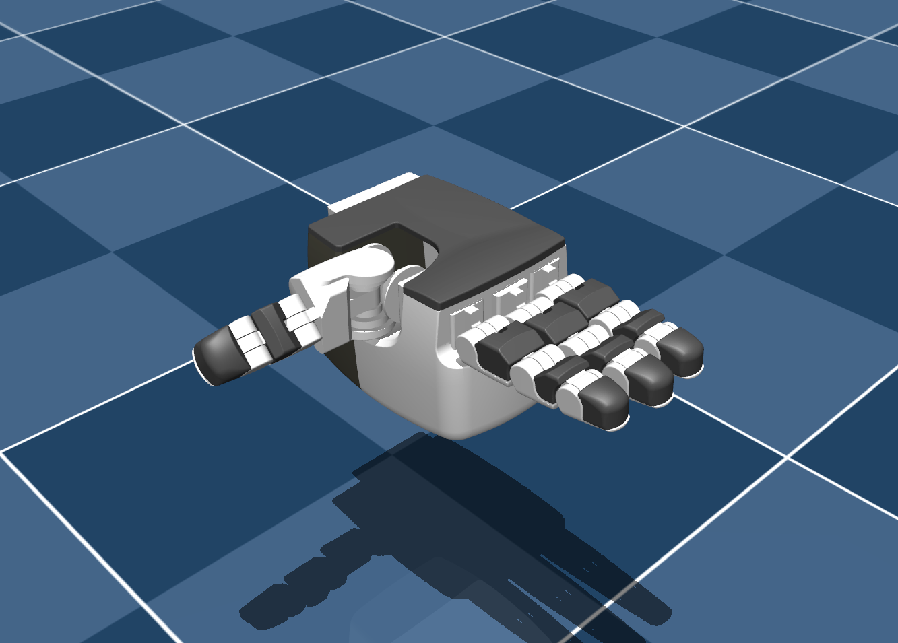

# Torobo Hand Description (MJCF)

Requires MuJoCo 3.1.0 or later.

## Overview

This package contains a simplified robot description (MJCF) of the
[Torobo Hand](https://robotics.tokyo/products/hand/) developed by [Tokyo Robotics](https://robotics.tokyo/).

  

## License

This model is released under an [BSD 3-Clause License](LICENSE).