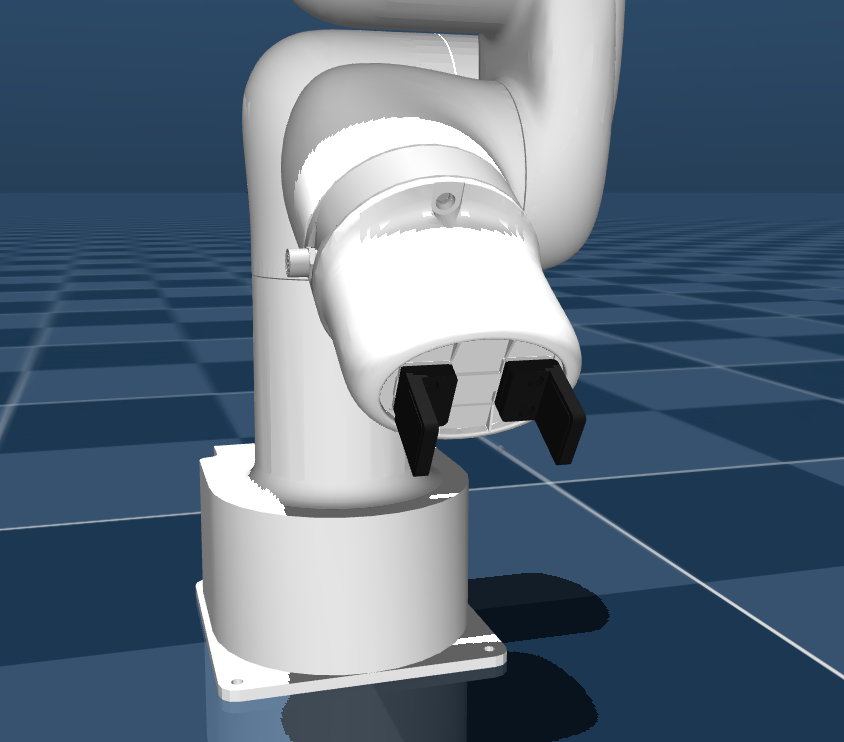
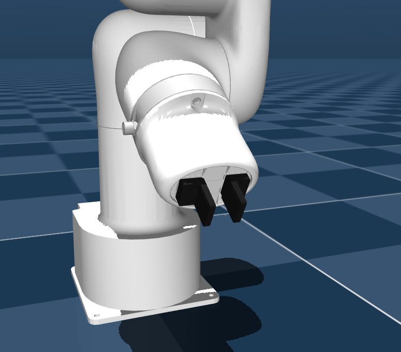

# Lite 6 Description (MJCF)

> [!IMPORTANT]
> Requires MuJoCo 3.1.0 or later.

## Changelog

See [CHANGELOG.md](./CHANGELOG.md) for a full history of changes.

## Overview

This package contains a simplified robot description (MJCF) of the
[Lite 6](https://www.ufactory.cc/product-page/ufactory-lite-6) developed by
[UFactory](https://www.ufactory.cc/). It is derived from the [publicly available
URDF
description](https://github.com/xArm-Developer/xarm_ros2/tree/master/xarm_description/urdf/lite6). 3 versions are provided: no gripper, wide gripper, and narrow gripper. The gripper fingers can be attached in two orientations, narrrow (so that they close fully) or wide (so that wider objects can be gripped). This provides some flexibility with the limited range of the gripper.

  
  <figcaption>No gripper</figcaption>

  
  
  <figcaption>Wide gripper configuration, fully closed (initial position) and open</figcaption>

  
  
  <figcaption>Narrow gripper confgiguration, fully closed (initial position) and open</figcaption>

## URDF → MJCF derivation steps

1. Added `<mujoco> <compiler discardvisual="false" strippath="false" fusestatic="false"/> </mujoco>` to the URDF's
   `<robot>` clause in order to preserve visual geometries.
2. Loaded the URDF into MuJoCo and saved a corresponding MJCF.
3. Manually edited the MJCF to extract common properties into the `<default>` section.
4. Added actuators.
5. Added `scene.xml` which includes the robot, with a textured groundplane, skybox, and haze.

### Gripper

The URDF only contains a gripper model for the Lite 6 with the fingers fused to the gripper body. To separate the fingers, the .step file of the fused body from the [Ufactory website](https://www.ufactory.cc/download/) was loaded into Onshape ([file here](https://cad.onshape.com/documents/f60aac1c8ff6af8f490dc855/w/5c0df4bc7414802fc89a514e/e/7dc41825dd66894c14b085ca?renderMode=0&uiState=66bdfb41f48d6a182064f4a4)) and split along the tracks that the fingers run on.  Because MuJoCo forms a convex hull for collision meshes, it was necessary to separate the wide fingers into the base and tip for realistic gripping.

Because they are actuated via an air compressor, a single `motor` actuator was used in the model, with an equality constraint to mimic the gearing mechanism that keeps them equidistant from the centre. There is no position control of the gripper.

The moments of inertia were estimated in Onshape due to not having any data from the manufacturer. This was done by choosing a density that matched the mass of the actual part, and assuming a uniform mass distribution (which is not the actual case but should be close enough).

## License

This model is released under a [BSD-3-Clause License](LICENSE).
