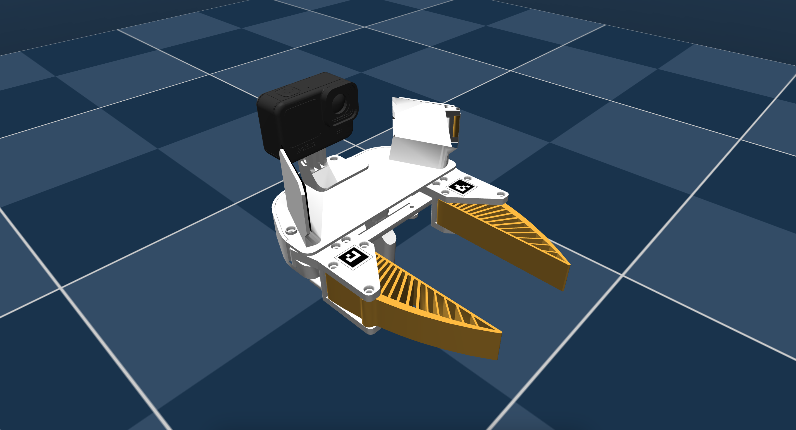

## UMI-Gripper Description (MJCF)

> [!IMPORTANT]
> Requires MuJoCo 2.2.2 or later.

## Changelog

See [CHANGELOG.md](./CHANGELOG.md) for a full history of changes.

### Overview

This package contains a simplified robot description (MJCF) of the [Universal Manipulation Interface (UMI) Gripper](http://umi-gripper.github.io/). It is derived from the publicly available gripper [model](https://docs.google.com/document/d/1TPYwV9sNVPAi0ZlAupDMkXZ4CA1hsZx7YDMSmcEy6EU/edit?tab=t.0).

  

### Acknowledgments

This model was contributed by Omar Rayyan (@omarrayyann).

### SOLIDWORKS -> URDF -> MJCF derivation step

1. Converted the the CAD model provided [(here)](https://docs.google.com/document/d/1TPYwV9sNVPAi0ZlAupDMkXZ4CA1hsZx7YDMSmcEy6EU/edit?tab=t.0) to the URDF format using [this](http://wiki.ros.org/sw_urdf_exporter) SolidWorks add-in.
2.  Added `<mujoco> <compiler balanceinertia="true" discardvisual="false"/> </mujoco>` to the URDF's
   `<robot>` clause in order to preserve visual geometries.
3. Loaded the URDF into MuJoCo and saved a corresponding MJCF.
4. Added materials and textures for the mirrors and ArUco markers (`right_aruco_sticker.png`, `left_aruco_sticker.png`).
5. Created a `<default>` section to define common properties for joints, actuators, and geoms.
6. Added two mirror geoms (`left_mirror`, `right_mirror`) with reflective materials for enhanced visual effects.
7. Added a `<tendon>` section with a fixed tendon named split to synchronize the movement of both fingers.
8. Added position-controlled actuators for the fingers joints (tuned `impratio="10"` for better non-slip interaction).
9. Added slide joints for controlling the gripper's movement along the X, Y, and Z axes.
10. Added hinge joints for controlling the rotation around the X, Y, and Z axes.
11. Added `scene.xml` which includes the robot, with a textured groundplane, skybox, and haze.

## License

This model is released under an [MIT License](LICENSE).
