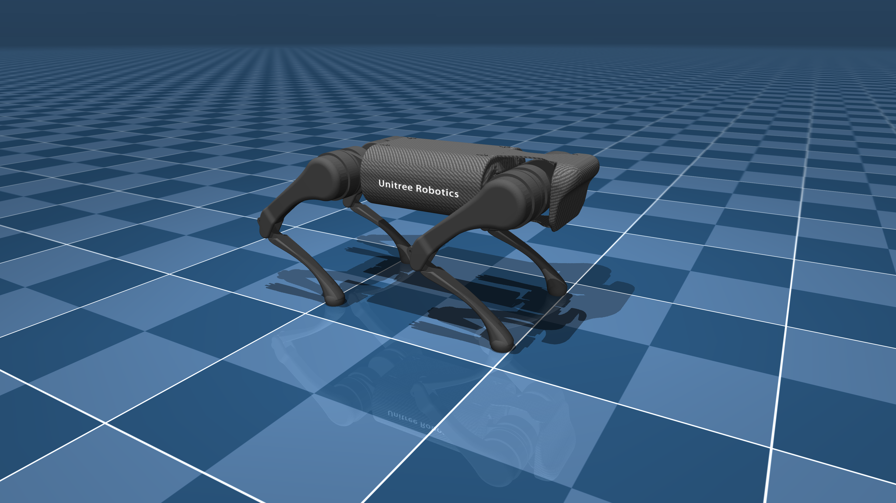

# Unitree A1 Description (MJCF)

> [!IMPORTANT]
> Requires MuJoCo 2.2.2 or later.

## Changelog

See [CHANGELOG.md](./CHANGELOG.md) for a full history of changes.

## Overview

This package contains a simplified robot description (MJCF) of the [A1 Quadruped
Robot](https://www.unitree.com/a1/) developed by [Unitree
Robotics](https://www.unitree.com/). It is derived from the [publicly available
URDF
description](https://github.com/unitreerobotics/unitree_mujoco/tree/main/data/a1/urdf).

  

## URDF → MJCF derivation steps

1. Converted the DAE [mesh
   files](https://github.com/unitreerobotics/unitree_mujoco/tree/main/data/a1/meshes)
to OBJ format using [Blender](https://www.blender.org/).
2. Processed `.obj` files with [`obj2mjcf`](https://github.com/kevinzakka/obj2mjcf).
3. Added `<mujoco> <compiler discardvisual="false"/> </mujoco>` to the URDF's
   `<robot>` clause in order to preserve visual geometries.
4. Loaded the URDF into MuJoCo and saved a corresponding MJCF.
5. Added a `<freejoint/>` to the base, and a tracking light.
6. Manually edited the MJCF to extract common properties into the `<default>` section.
7. Manually designed collision geometries.
8. Shifted joint reference values and ranges so that 0 corresponds to standing pose.
9. Softened the contacts of the feet to approximate the effect of rubber and
   increased `impratio` to reduce slippage.
10. Added `scene.xml` which includes the robot, with a textured groundplane, skybox, and haze.

## License

This model is released under a [BSD-3-Clause License](LICENSE).
