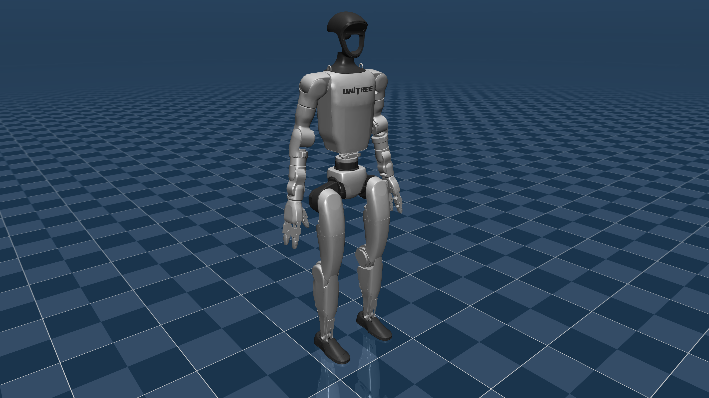
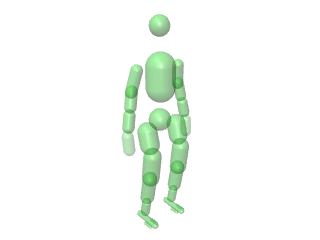

# Unitree G1 Description (MJCF)

> [!IMPORTANT]
> Requires MuJoCo 2.3.4 or later.

## Changelog

See [CHANGELOG.md](./CHANGELOG.md) for a full history of changes.

## Overview

This package contains a simplified robot description (MJCF) of the [G1 Humanoid
Robot](https://www.unitree.com/g1/) developed by [Unitree
Robotics](https://www.unitree.com/). It is derived from the [publicly available
MJCF
description](https://github.com/unitreerobotics/unitree_ros/blob/master/robots/g1_description/g1_29dof_rev_1_0.xml).

<p float="left">
  
  
</p>

## MJCF derivation steps

1. Copied the MJCF description from [g1_description](https://github.com/unitreerobotics/unitree_ros/blob/master/robots/g1_description/g1_29dof_rev_1_0.xml).
2. Manually edited the MJCF to extract common properties into the `<default>` section.
3. Added stand keyframe.
4. Added joint position actuators (needs tuning).
5. Applied similar edits to `g1_with_hands.xml`.

## MJX

A version of [g1.xml](g1.xml) for use in [MJX](https://mujoco.readthedocs.io/en/stable/mjx.html) is available in `scene_mjx.xml` with the following changes:

* Manually designed collision geoms and corresponding contact pairs (see figure below).
* Tuned solver and line search iterations.
* Used lower, more realistic PD gains.
* Added `home` and `knees_bent` keyframes.

The above model was successfully transfered to hardware in [MuJoCo Playground](https://playground.mujoco.org/).

<p float="left">
  
</p>

## License

This model is released under a [BSD-3-Clause License](LICENSE).

## Publications

If you use the MJX model in your work, please use the following citation:

```bibtex
@misc{zakka2025mujocoplayground,
  title={MuJoCo Playground},
  author={Kevin Zakka and Baruch Tabanpour and Qiayuan Liao and Mustafa Haiderbhai and Samuel Holt and Jing Yuan Luo and Arthur Allshire and Erik Frey and Koushil Sreenath and Lueder A. Kahrs and Carmelo Sferrazza and Yuval Tassa and Pieter Abbeel},
  year={2025},
  eprint={2502.08844},
  archivePrefix={arXiv},
  primaryClass={cs.RO},
  url={https://arxiv.org/abs/2502.08844},
}
```
