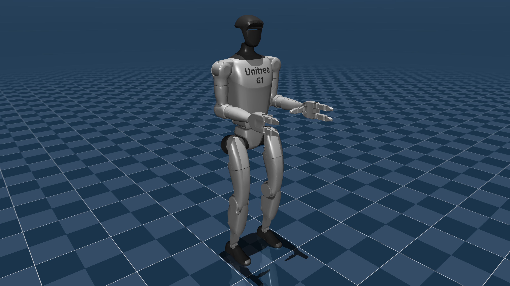

# Unitree G1 Description (MJCF)

Requires MuJoCo 2.2.2 or later.

## Overview

This package contains a simplified robot description (MJCF) of the [G1 Humanoid
Robot](https://www.unitree.com/g1/) developed by [Unitree
Robotics](https://www.unitree.com/). It is derived from the [publicly available
MJCF
description](https://github.com/unitreerobotics/unitree_ros/tree/master/robots/g1_description).

  

## MJCF derivation steps

1. Copied the MJCF description from [g1_description](https://github.com/unitreerobotics/unitree_ros/tree/master/robots/g1_description).
2. Manually edited the MJCF to extract common properties into the `<default>` section.
3. Added sites for the IMU, head and feet.
4. Add IMU sensor (gyro, accelero, framequat).
5. Added stand keyframe.
6. Added spotlight and tracking light.

## License

This model is released under a [BSD-3-Clause License](LICENSE).
