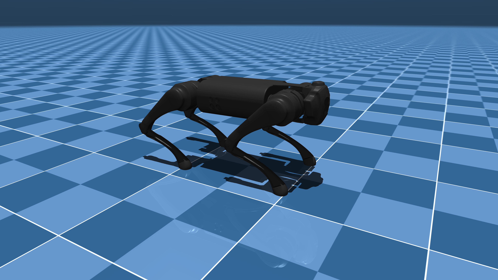

# Unitree Go1 Description (MJCF)

> [!IMPORTANT]
> Requires MuJoCo 2.2.2 or later.

## Changelog

See [CHANGELOG.md](./CHANGELOG.md) for a full history of changes.

## Overview

This package contains a simplified robot description (MJCF) of the [Go1
Quadruped Robot](https://www.unitree.com/go1/) developed by [Unitree
Robotics](https://www.unitree.com/). It is derived from the [publicly available
URDF
description](https://github.com/unitreerobotics/unitree_ros/tree/master/robots/go1_description).

  

## URDF → MJCF derivation steps

1. Manually edited the MJCF to extract common properties into the `<default>` section.
2. Manually designed collision geometries.
3. Softened the contacts of the feet to approximate the effect of rubber and
   increased `impratio` to reduce slippage.
4. Added `scene.xml` which includes the robot, with a textured groundplane, skybox, and haze.

## License

This model is released under a [BSD-3-Clause License](LICENSE).
