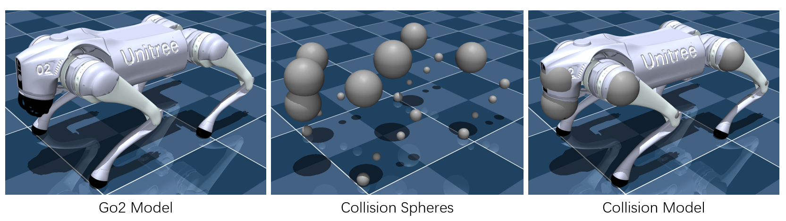

# Unitree Go2 Description (MJCF)

> [!IMPORTANT]
> Requires MuJoCo 2.2.2 or later.

## Changelog

See [CHANGELOG.md](./CHANGELOG.md) for a full history of changes.

## Overview

This package contains a simplified robot description (MJCF) of the [Go2
Quadruped Robot](https://www.unitree.com/go2/) developed by [Unitree
Robotics](https://www.unitree.com/). It is derived from the [publicly available
URDF
description](https://github.com/unitreerobotics/unitree_ros/tree/master/robots/go2_description).

  

## URDF → MJCF derivation steps

1. Converted the DAE [mesh
   files](https://github.com/unitreerobotics/unitree_ros/tree/master/robots/go2_description/meshes) to OBJ format using [Blender](https://www.blender.org/).
   - When exporting, ensure "up axis" is `+Z`, and "forward axis" is `+Y`.
2. Processed `.obj` files with [`obj2mjcf`](https://github.com/kevinzakka/obj2mjcf).
3. Added `<mujoco> <compiler discardvisual="false" strippath="false" fusestatic="false"/> </mujoco>` to the URDF's
   `<robot>` clause in order to preserve visual geometries.
4. Loaded the URDF into MuJoCo and saved a corresponding MJCF.
5. Added a `<freejoint/>` to the base.
6. Manually edited the MJCF to extract common properties into the `<default>` section.
7. Softened the contacts of the feet to approximate the effect of rubber and
   increased `impratio` to reduce slippage.
8. Added `scene.xml` which includes the robot, with a textured groundplane, skybox, and haze.

## MJX

A version of the Unitree Go2 model for use in MJX is available in `scene_mjx.xml` with the following changes:

1. The solver `iterations` and `ls_iterations` were modified for performance.
2. `frictionloss` was removed.
3. The friction cone was changed from `elliptic` to `pyramidal`.
4. All contacts other than the sphere geoms were changed to sphere geoms and placed at the joints positions to simulate collisions at critical locations.
   - Note: Currently, MJX cannot deal with collision geoms other than spheres. In this case, we have to put many collision spheres in critical locations of the robot such as joints, torso, and feet as illustrated below.

  

## License

This model is released under a [BSD-3-Clause License](LICENSE).

## Acknowledgments

The MJX model of Go2 was contributed by [lonelyfluency](https://github.com/lonelyfluency).
