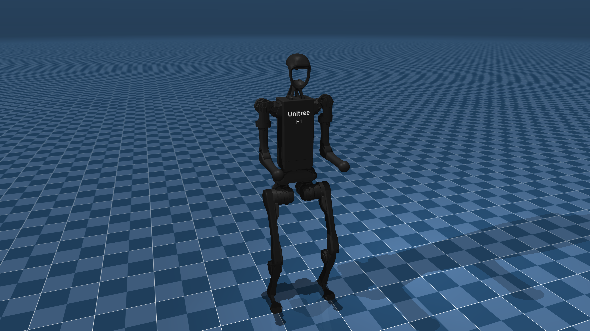

# Unitree H1 Description (MJCF)

Requires MuJoCo 2.2.2 or later.

## Overview

This package contains a simplified robot description (MJCF) of the [H1 Humanoid
Robot](https://www.unitree.com/h1/) developed by [Unitree
Robotics](https://www.unitree.com/). The original URDF and assets were provided
directly by [Unitree Robotics](https://www.unitree.com/) under a [BSD-3-Clause
License](LICENSE).

  

## URDF → MJCF derivation steps

1. Added `<mujoco> <compiler discardvisual="false" strippath="false" fusestatic="false"/> </mujoco>` to the URDF's
   `<robot>` clause in order to preserve visual geometries.
2. Loaded the URDF into MuJoCo and saved a corresponding MJCF.
3. Manually edited the MJCF to extract common properties into the `<default>` section.
4. Added actuators.
5. Added `scene.xml` which includes the robot, with a textured groundplane, skybox, and haze.

## License

This model is released under a [BSD-3-Clause License](LICENSE).
