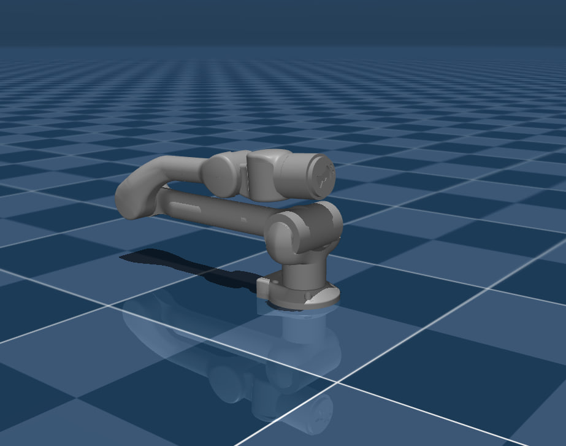

# Unitree Z1 description (MJCF)

> [!IMPORTANT]
> Requires MuJoCo 2.3.3 or later.

## Changelog

See [CHANGELOG.md](./CHANGELOG.md) for a full history of changes.

## Overview

This package contains a simplified robot description (MJCF) of the [Z1
manipulator](https://www.unitree.com/z1/) developed by [Unitree
Robotics](https://www.unitree.com/). It is derived from the [publicly available
URDF
description](https://github.com/unitreerobotics/unitree_ros/blob/master/robots/z1_description/).

  

## URDF → MJCF derivation steps

1. Added `<mujoco><compiler discardvisual="false" fusestatic="false"/></mujoco>` to the URDF's `<robot>` clause in order to preserve visual geometries.
2. Loaded the URDF into MuJoCo and saved a corresponding MJCF.
3. Manually edited the MJCF to extract common properties into the `<default>` section.
4. Added position-control actuators.
5. Added `scene.xml` which includes the robot, with a textured groundplane, skybox, and haze.

## License

This model is released under a [BSD-3-Clause License](LICENSE).
