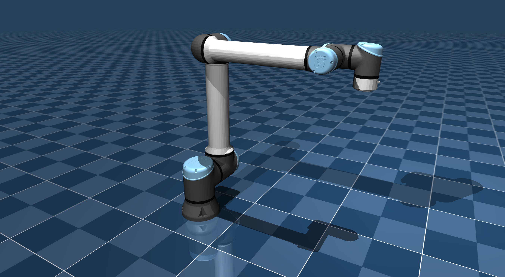

# Universal Robots UR10e Description (MJCF)

> [!IMPORTANT]
> Requires MuJoCo 2.3.3 or later.

## Changelog

See [CHANGELOG.md](./CHANGELOG.md) for a full history of changes.

## Overview

This package contains a simplified robot description (MJCF) of the
[UR10e](https://www.universal-robots.com/products/ur10-robot/) developed by
[Universal Robots](https://www.universal-robots.com/). It is derived from the
[publicly available URDF
description](https://github.com/ros-industrial/universal_robot/tree/kinetic-devel/ur_e_description).

  

### URDF → MJCF derivation steps

1. Converted the DAE [mesh
   files](https://github.com/ros-industrial/universal_robot/tree/kinetic-devel/ur_e_description/meshes/ur10e/visual)
   to OBJ format using [Blender](https://www.blender.org/).
    - In this process, the Z axis of the joint that a link is connected to should point up.
2. Processed `.obj` files with [`obj2mjcf`](https://github.com/kevinzakka/obj2mjcf).
3. Added `<mujoco> <compiler discardvisual="false"/> </mujoco>` to the URDF's
   `<robot>` clause in order to preserve visual geometries.
4. Loaded the URDF into MuJoCo and saved a corresponding MJCF.
5. Added a tracking light to the base.
6. Manually edited the MJCF to extract common properties into the `<default>` section.
7. Manually edited colors to match UR10 colors.
8. Added position-controlled actuators and joint damping and armature. Note
   that these values have not been carefully tuned -- contributions are more
   than welcome to improve them.
9. Added home joint configuration as a `keyframe`.
10. Manually designed collision geometries to be as realistic as the UR10's shape.
11. Added `scene.xml`, which includes the robot, with a textured ground plane, skybox, and haze.

### Notes

Although the model is stable in the `scene.xml`, you might see unstable behavior when combined with
other models (i.e., Robotiq-2F85 gripper). Switching the integrator from `Euler` to `RK4` helps in
these cases.

## License

This model is released under a [BSD-3-Clause License](LICENSE).
