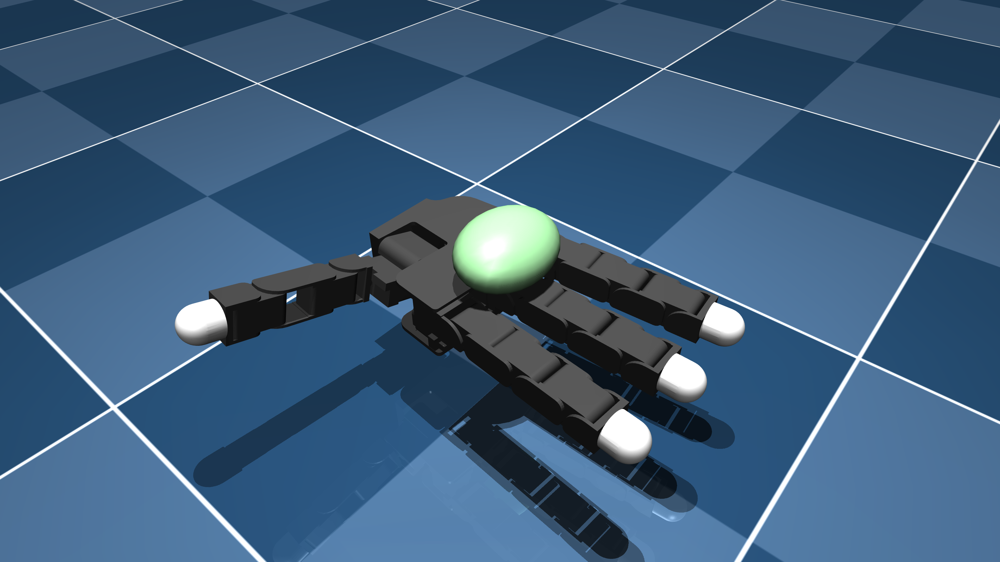

# Allegro Hand V3 Description (MJCF)

> [!IMPORTANT]
> Requires MuJoCo 2.2.2 or later.

## Changelog

See [CHANGELOG.md](./CHANGELOG.md) for a full history of changes.

## Overview

This package contains a simplified robot description (MJCF) of the [Allegro Hand
v3](https://www.wonikrobotics.com/research-robot-hand) robot developed by [Wonik
Robotics](https://www.wonikrobotics.com/), including both right-handed and
left-handed versions. They are derived from the [publicly available URDF
descriptions](https://github.com/simlabrobotics/allegro_hand_ros/blob/master/allegro_hand_description/).

  

## URDF → MJCF derivation steps

1. Added `<mujoco> <compiler discardvisual="false"/> </mujoco>` to the
   [URDF](https://github.com/simlabrobotics/allegro_hand_ros/blob/master/allegro_hand_description/allegro_hand_description_right.urdf)'s
   `<robot>` clause in order to preserve visual geometries.
2. Loaded the URDF into MuJoCo and saved a corresponding MJCF.
3. Added base body.
4. Manually edited the MJCF to extract common properties into the `<default>` section.
5. Added `<exclude>` clauses to prevent collisions between the palm and fingers.
6. Added position-controlled actuators.
7. Scaled the global density to be `1000 * actual_mass / current_mass`.
8. Added `scene_left.xml` and `scene_right.xml` which include the robot, with
    an object, textured groundplane, skybox, and haze.

## License

These models are released under a [BSD-2-Clause License](LICENSE).
